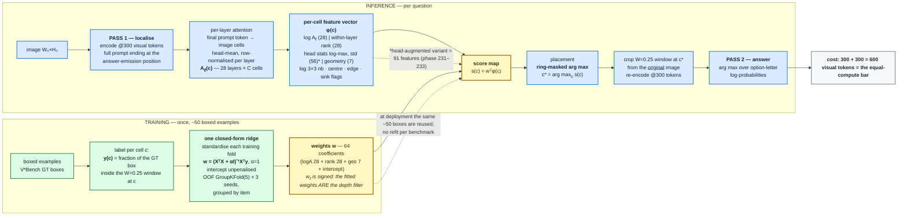

# DWA ridge — architecture

Rendered figure: `paper/figs/fig_dwa_arch.pdf` / `.png`.
Mermaid source: `paper/figs/mermaid/dwa_ridge.mmd`.

## Components (as implemented)

| block | detail | code |
|---|---|---|
| Localise pass | 300 visual tokens, full prompt ending at the answer-emission position; attention read from the final prompt token to image cells, head-mean, row-normalised per layer | `phase30c_dump_attn.py`, `phase225_newbench.py::localise` |
| Features (deployed, 63) | 28 log A_l, 28 within-layer ranks, 7 geometry (log 3x3 nb of the block-mean map, centre/edge, fx/fy, last-col/row sink flags) | `phase202_feature_ablation.py::feats_from` |
| Features (head variant, 91) | 28 log A_l, 28 log head-max, 28 head-std (per-cell head distribution), 7 geometry | `phase232_fit_headridge.py` |
| Ridge | `w = (XᵀX + αI)⁻¹Xᵀy`, α=1, unpenalised intercept, standardisation per training fold, OOF GroupKFold(5) × 3 seeds grouped by item | `phase184_allarms.py`, `phase202_*`, `phase232_*` |
| Label | fraction of the GT box inside the W=0.25 window centred at the cell | `phase70_rerank_head.coverage` |
| Placement | ring-masked arg max of `s(c) = wᵀφ(c)` | `fig_ridge_scores.py`, `phase225_*` |
| Answer | crop W=0.25 at the cell from the original image, re-encode @300 tokens, arg max over option-letter log-probs | `phase184_allarms.py::answer` |
| Cost | 300 + 300 = 600 visual tokens = equal-compute bar | — |
